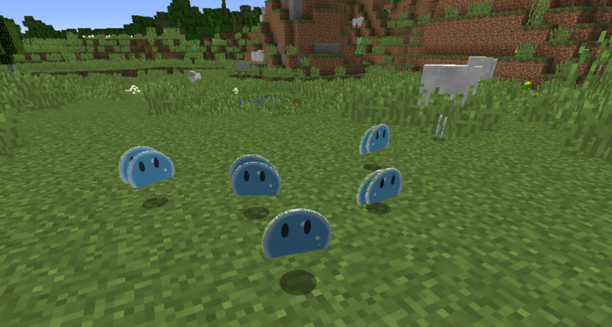
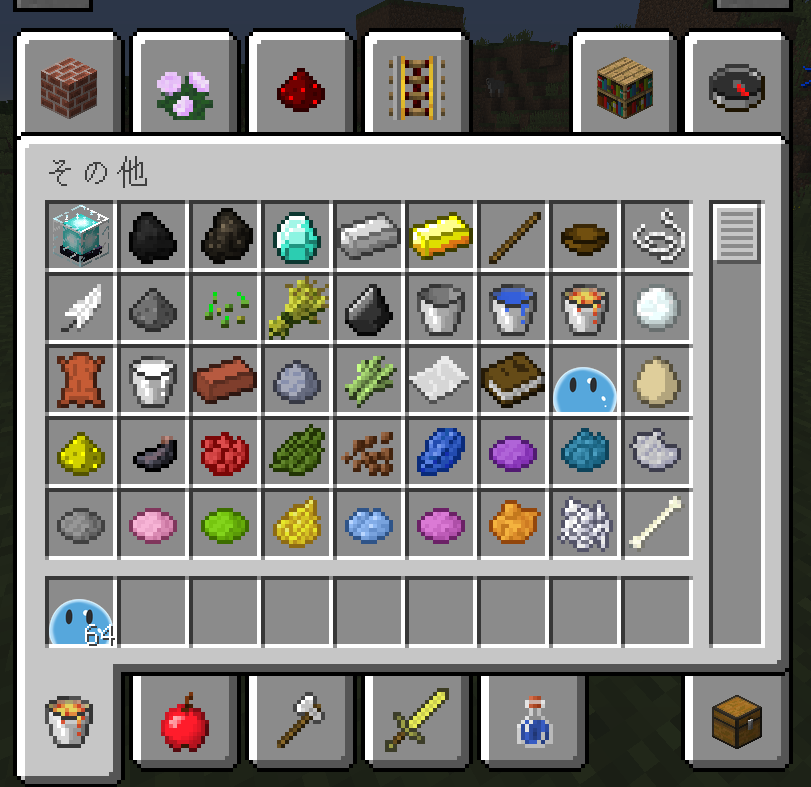

# nyaimu-resourcepack

バニラの「スライムボール」アイテムのテクスチャを、ペットスライム「ニャイム」に差し替えるリソースパックです。
変わるのはスライムボールだけで、ほかはバニラのままです。

- 対応: **Minecraft 1.12.2 〜 26.3**（動作確認: 1.12.2 / 1.13 / 26.3）
- テクスチャ（64x64）:
  - 1.12.2 以前: `assets/minecraft/textures/items/slimeball.png`
  - 1.13 以降: `assets/minecraft/textures/item/slime_ball.png`
- ライセンス: **CC0 1.0**

## 導入方法

1. Releases から zip をダウンロードします（解凍しないでください）。
2. `.minecraft/resourcepacks` に入れます。
3. ゲーム内の「オプション > リソースパック」で `nyaimu-resourcepack-1.1.0.zip` を有効にします。

補足:
- 1.13 以降では「古いバージョン向け」と表示されますが、そのまま有効にして使えます。
- 独自のスライムボールテクスチャを使っているmodのアイテムは変わりません。

## ニャイムについて

ペットスライム「ニャイム」はBoothで販売しています。
Buy Me! https://booth.pm/ja/items/5036167

---

# nyaimu-resourcepack (English)

Replaces the vanilla **Slimeball** item texture with Nyaimu, the pet slime.
Only the slimeball changes; everything else stays vanilla.

- Minecraft: **1.12.2 – 26.3** (tested: 1.12.2 / 1.13 / 26.3)
- Texture (64x64):
  - 1.12.2 and earlier: `assets/minecraft/textures/items/slimeball.png`
  - 1.13 and later: `assets/minecraft/textures/item/slime_ball.png`
- License: **CC0 1.0**

## Install

1. Download the zip from Releases (do not unzip it).
2. Put it in `.minecraft/resourcepacks`.
3. In game: Options > Resource Packs, then enable `nyaimu-resourcepack-1.1.0.zip`.

Notes:
- On 1.13 and later, the pack is marked as made for an older version. You can still enable and use it.
- Mods that use their own slimeball texture are not affected.

## About Nyaimu

Nyaimu, the pet slime, is sold on Booth.
Buy Me! https://booth.pm/en/items/5036167
